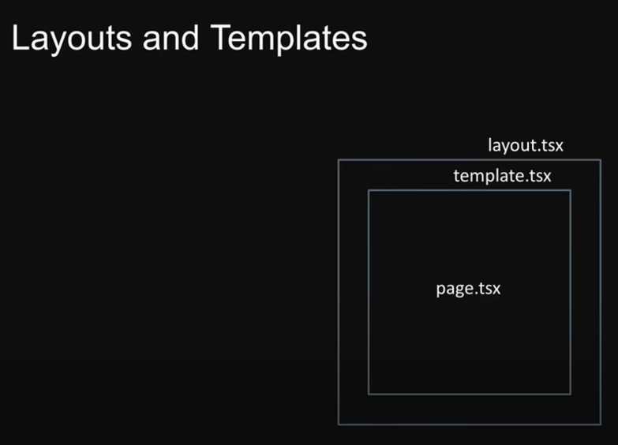
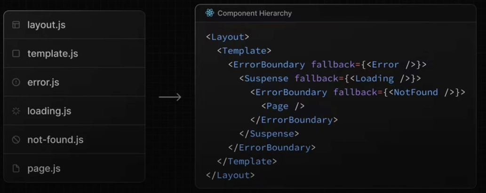
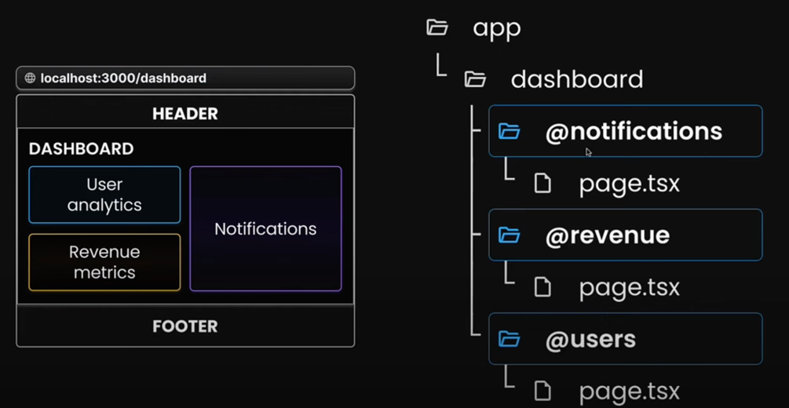
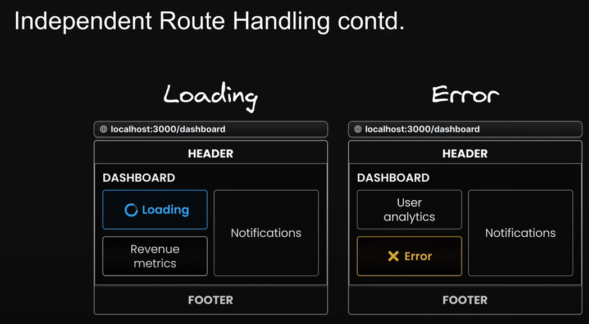
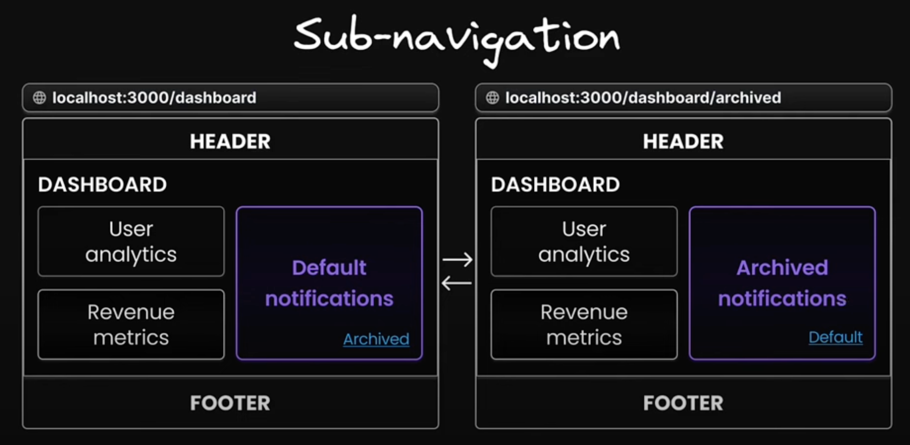
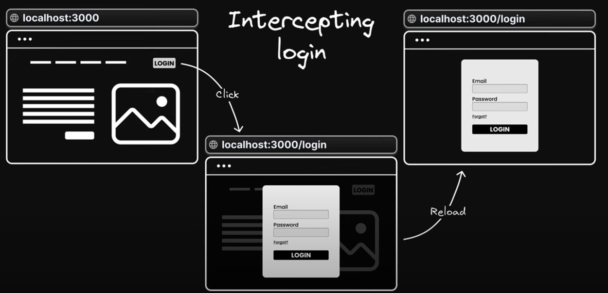

# Next14 Tutorial
참고영상 : https://www.youtube.com/playlist?list=PLC3y8-rFHvwjOKd6gdf4QtV1uYNiQnruI

### Dynamic Routes
디렉토리명을 `[%NAME%]`로 사용한다.
- sample source: [src/app/products/[productId]](src/app/products/[productId]/page.tsx)
- productId를 parameter로 사용할 수 있다.

#### Nested Dynamic Routes
- sample source: [/src/app/products/[productId]/reviews/[reviewId]/page.tsx](/src/app/products/[productId]/reviews/[reviewId]/page.tsx)
- productId와 reviewId를 parameter로 사용할 수 있다.

### Catch-All Routes [...]
디렉토리에 [...slug]를 사용한다.
- sample source: /src/docs
  [src/app/docs/[[...slug]]/page.tsx](src/app/docs/[[...slug]]/page.tsx)
- 경로 전체를 parameter로 사용할 수 있다.
#### Optional Catch-All Routes [[...slug]]
경로 파라미터가 없을 경우 404 오류가 발생하지 않도록 선택적 파라미터를 사용할 수 있다.
디렉토리에 중첩된 대괄로 [[...slug]]를 사용한다.

### Not found
해당 경로에 not-found 페이지를 생성한다.
- sample source: [src/app/not-found.tsx](src/app/not-found.tsx)
- 경로마다 not-found 페이지를 생성할 수 있다.

#### Conditional Not found
notFound() 함수를 사용하여 조건에 따라 not-found 페이지로 이동할 수 있다.
```javascript
import {notFound} from "next/navigation";
export default function ReviewDetail({ params } : {
  params: {
    productId: string,
    reviewId: string
  }
}) {
  if (parseInt(params.reviewId) < 1000) {
    notFound()
  }
  
  return (
    <div>
      <h1>Review { params.reviewId } for product { params.productId }</h1>
    </div>
  )
}
```
### Private Folders
디렉토리 명을 _로 시작하면 URL을 통해 접근하지 못함
- sample source: [src/app/_lib/page.tsx](src/app/_lib/page.tsx)

### Route Groups
디렉토리 명을 ()로 묶으면 라우팅 경로에 적용되지 않는다. 
- sample source: [src/app/(auth)](src/app/(auth))
- 관련된 파일을 그룹화할 수 있다.
- Route Group Layout을 적용할 수 있다.

### Routing Metadata
`default`, `template`을 사용해 SEO를 위한 메타데이터를 추가할 수 있다.
- sample source: [src/app/layout.tsx](src/app/layout.tsx)
```javascript
export const metadata: Metadata = {
  title: {
    default: "Next.js Tutorial - Kyutae",
    template: "%s | Company Name",
  },
  description: 'Generated by Next.js',
}
```

#### 개별 Metadata 적용
`absolute`를 통해 상위 정의된 메타데이터를 덮어쓸 수 있다.
- sample source: [src/app/blog/page.tsx](src/app/blog/page.tsxv)

### Layouts and Templates
Layouts는 페이지 전환 시 useState의 상태값이 유지되는 반면, Templates는 페이지 전환 시 상태값이 유지되지 않는다.
- sample source: [src/app/(auth)/templates.tsx](src/app/(auth)/templates.tsx)


### Loading UI
loading 기능을 사용해 페이지 전환 시 로딩 UI를 보여줄 수 있다.
- sample source: [src/app/blog/loading.tsx](src/app/blog/loading.tsx)


### Component Hierarchy


### Parallel Routes


@로 정의된 컴포넌트들을 layout 파일에서 Props로 받아 사용할 수 있다.
- sample source: [src/app/complex-dashboard/layout.tsx](src/app/complex-dashboard/layout.tsx)


각 컴포넌트별 독립적으로 Handling할 수 있다.

#### Sub-navigation

- sample source: [src/app/complex-dashboard/@notifications/archived](src/app/complex-dashboard/@notifications/archived)
페이지를 새로고침할 경우 각 컴포넌트별(@) default.tsx가 실행된다. default.tsx가 없을 경우 404 오류가 발생한다.

## Parallel Intercepting Routes

### 동일 레벨 구성(.)
sample source: /src/f1/(.)f2/page.tsx
/f1 -> f2로 이동시 intercept된다.

### 하위 레벨 구성(..)
sample source: /src/f1/f4/(..)f3/page.tsx
/f4 -> f3로 이동시 intercept된다.

### 루트 레벨 구성(...)
sample source: /src/f1/f4/(...)about/page.tsx
/f4 -> f3로 이동시 intercept된다.
